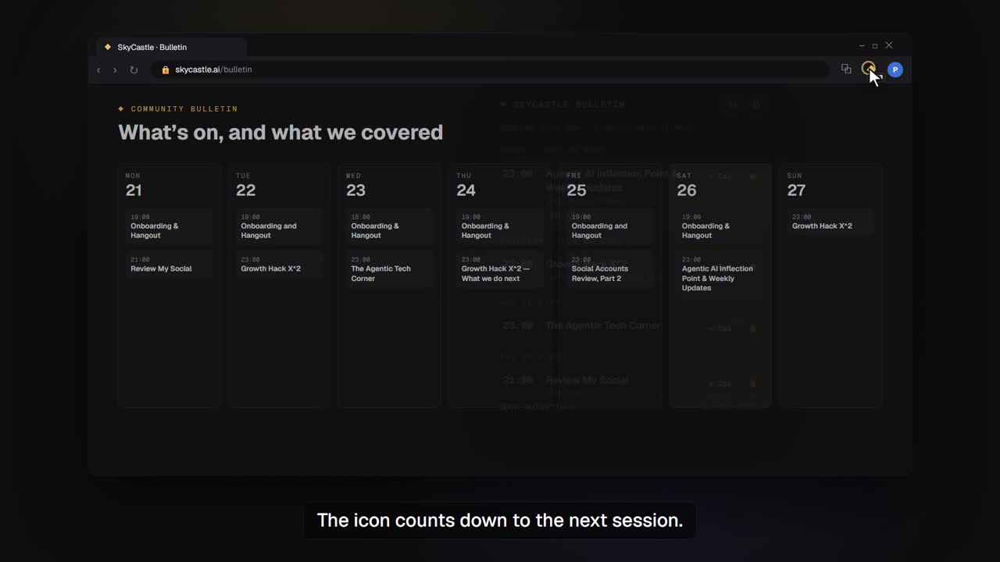

# SkyCastle Bulletin — Chrome extension

Reminders for SkyCastle community sessions (https://skycastle.ai/bulletin), plus
one-click Google Calendar links and an `.ics` export.

Unofficial community project, not affiliated with SkyCastle. Needs a SkyCastle
member login.

[](https://github.com/przemekzur/skycastle-bulletin/releases/download/v0.1.0/skycastle-bulletin-demo.mp4)

▶ [Watch the 1-minute demo](https://github.com/przemekzur/skycastle-bulletin/releases/download/v0.1.0/skycastle-bulletin-demo.mp4) (narrated, with captions)

## Install

1. Download the latest `skycastle-bulletin-x.y.z.zip` from
   [Releases](https://github.com/przemekzur/skycastle-bulletin/releases/latest) and unzip it.
2. Open `chrome://extensions` and turn on **Developer mode** (top right).
3. Click **Load unpacked** and select the unzipped folder.
4. Pin the extension, open it, click ⚙ → **Test notification**.
   If nothing appears, allow Chrome notifications in Windows Settings → System → Notifications.
5. Stay logged in at skycastle.ai. The icon shows a red `!` if you are logged out.

To update: download the new zip, replace the folder, and click ↻ on the extension card
in `chrome://extensions`.

## Privacy

- No passwords or tokens are handled. The extension calls `skycastle.ai` from your browser
  and Chrome attaches your existing SkyCastle session. It has no `cookies` permission and
  no access to any other site.
- Sessions and settings are stored only in your browser (`chrome.storage.local`).
  Nothing is sent anywhere else.
- Times come from the API in UTC and are shown in your computer's time zone.

## How it works

- The bulletin page is backed by `GET https://skycastle.ai/api/bulletin`
  (`{ sessions, topics, entries }`). It needs your SkyCastle login (401 without),
  so the extension calls it from inside Chrome using your existing session.
- VibeSchool sessions are per-cohort and come from `GET /api/me/cohort`
  (`{ cohort: null }` until you are in a cohort). Any dated sessions found there
  are merged in and tagged VIBESCHOOL.
- The service worker refreshes every 15 minutes and sets one `chrome.alarms` alarm per
  reminder (N minutes before, and optionally at start). The badge shows the countdown
  to the next session, or `LIVE`, or `!` when you are logged out.

## Popup

- `+ Cal`: opens a pre-filled Google Calendar event.
- Bell: mute or unmute reminders for one session.
- Settings: reminder lead time, start notification, show daily Onboarding & Hangout,
  keyword filter (e.g. `richard, agentic`), **Export .ics** (import it via Google Calendar
  → Settings → Import & export).

## Dev

```
node scripts/test-lib.mjs      # logic tests (normalise, filters, ICS, Google URL)
node scripts/make-icons.mjs    # regenerate icons/
node scripts/preview.mjs       # popup with fake chrome.* on http://localhost:4891/
```

You can also load the repo folder itself with **Load unpacked**; `scripts/` is dev-only.

## License

MIT
